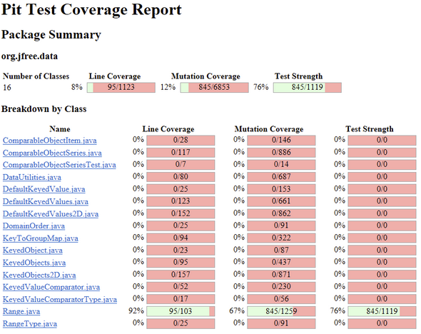
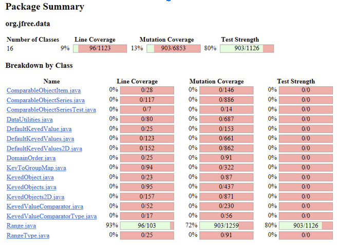
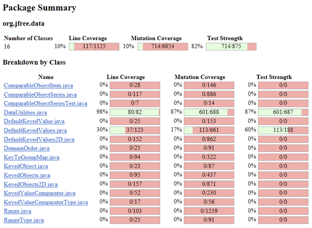

**SENG 438 - Software Testing, Reliability, and Quality**

**Lab. Report \#4 – Mutation Testing and Web app testing**

| Group \#5:      |     |
| -------------- | --- |
| Student Names: |     |
| Muhammad Tariq |     |
| Vrund Patel    |     |
| Anand Patel    |     |

# Introduction
We will practice mutation testing and GUI testing in this lab. We will attempt to implement mutation testing in part 1 of the lab using the test files for Range.java and DataUtilities.java that we previously developed in labs 2 and 3. To generate mutants automatically and run our tests against them, we use the testing tool Pitest. The first test and recording will be the initial mutation score based on our lab 3 submission files. By adding more testing instances, we want to raise this old mutation score by at least 10%. Also, we will examine the reasons behind the killing or not of 10 mutants from the Pitest report. We need this analysis in order to create new mutation tests. We will test the GUI in part 2 using the costco website. We automate our test cases using the Selenium IDE web-interface testing tool. For GUI tests, we must choose the order of the events we wish to test on the web interface. Our test group selected the sign-in, find a warehouse, create a list, add to cart, navigation, and search functions to test. To ensure thorough testing, we will put each functional component to the test using various potential data. We will run the recorded scripts to test the system after recording our test cases. Finally, we will report any flaws this test automation uncovered.

# Analysis of 10 Mutants of the Range class 

1. Decremented (--a) double field lower

    This mutant alters the source code - specifically the getLowerBound() method inside Range by decreasing the local variable ‘lower’ by 1. This alters the return value and gives the wrong lower bound value. Therefore the mutant is successfully killed in the original test suite due to the coverage of this method.

2. Incremented (++a) double field lower 

    This mutant alters the source code - specifically the getLowerBound() method inside Range by increasing the local variable ‘lower’ by 1. This alters the return value and gives the wrong lower bound value. Therefore the mutant is successfully killed in the original test suite due to the coverage of this method.

3. Negated double field lower

    This mutant alters the source code - specifically the getLowerBound() method inside Range by negating the local variable ‘lower’. This alters the return value and gives the wrong lower bound value. Therefore the mutant is successfully killed in the original test suite due to the coverage of this method.

4. Replaced double addition with division

    This mutant alters the source code - specifically the getCentralValue() method inside Range by replacing the addition with division to alter the logic of the calculation of the return value which is the central value between the lower and upper bound of a range. This therefore returns the wrong result as the central value and so the mutant is successfully killed in the original test suite due to the coverage of this method.

5. Replaced double addition with modulus

    This mutant alters the source code - specifically the getCentralValue() method inside Range by replacing the addition with modulus to alter the logic of the calculation of the return value which is the central value between the lower and upper bound of a range. This therefore returns the wrong result as the central value and so the mutant is successfully killed in the original test suite due to the coverage of this method.

6. Substituted 2.0 with -1.0

    This mutant alters the source code - specifically the getCentralValue() method inside Range by substituting 2.0 with -1.0. This alters the logic of the calculation of the return value which is the central value between the lower and upper bound of a range because in the calculation there includes a division by 2.0 and so this alters both the final ‘lower’ and ‘upper’ values resulting in a wrong result. Therefore the mutant is successfully killed in the original test suite due to the coverage of this method.

7. Less or equal to equal

    This mutant alters the source code - specifically the Range() constructor method inside Range by replacing the condition of if ‘lower’ is greater than ‘upper’ from checking if lower is less than or equal to upper to checking if they are equal. This check is to negate the branch, but making them equal makes the condition true in the case the test is trying to negate the branch. In the case it makes it true, it will throw an exception when it shouldn’t since the branch should be negated. Therefore the mutant is successfully killed in the original test suite due to the decision coverage of this branch.

8. Less or equal to greater or equal

    This mutant alters the source code - specifically the Range() constructor method inside Range by replacing the condition of if ‘lower’ is greater than ‘upper’ from checking if lower is less than or equal to upper to checking if lower is greater than or equal to upper. This check is to negate the branch, but making them greater than or to equal makes the condition true in the case the test is trying to negate the branch. In the case it makes it true, it will throw an exception when it shouldn’t since the branch should be negated. Therefore the mutant is successfully killed in the original test suite due to the decision coverage of this branch.

9. Less or equal to not equal

    This mutant alters the source code - specifically the Range() constructor method inside Range by replacing the condition of if ‘lower’ is greater than ‘upper’ from checking if lower is less than or equal to upper to checking if they are not equal. This check is to negate the branch, but making them not equal makes the condition true in the case the test is trying to negate the branch. In the case it makes it true, it will throw an exception when it shouldn’t since the branch should be negated. Therefore the mutant is successfully killed in the original test suite due to the decision coverage of this branch.

10. removed conditional - replace comparison check with false

    This mutant alters the source code - specifically the Range() constructor method inside Range by replacing the condition of if ‘lower’ is greater than ‘upper’ from checking if lower is less than or equal to upper to checking if they are not equal. This check is to negate the branch, but making the condition false always makes the condition false when the test is trying to go inside the branch (throw an exception when lower < upper). In the case it makes it false when the test is to make it true, it will not throw an exception when it should since the branch should be accepted. Therefore the mutant is successfully killed in the original test suite due to the decision coverage of this branch.

# Report all the statistics and the mutation score for each test class

RangeTest before update:

RangeTest after update:

DataUtilities before update:

DataUtilities after update:

# Analysis drawn on the effectiveness of each of the test classes

In the Range class, we were able to remove nearly 58 mutants which results in a 5% increase in mutant coverage. This was fairly effective, however there were many equivalent mutants which are unkillable.

In the DataUtilities class, the coverage was already pretty high and the remaining mutants seemed mostly equivalent and therefore unkillable. We were able to kill around 4 mutants which didn’t result in a mutation coverage increase.

While the RangeTest was more effective in terms of %, the initial statement coverage was much lower as well as the mutation coverage which made it easier to find and kill mutants that survived.

# A discussion on the effect of equivalent mutants on mutation score accuracy

Equivalent mutants are the biggest reason for low mutation coverage. There are many mutants that post decrement or post increment a local variable which is impossible to kill since the value is changed after a statement is executed. When it comes to executing a condition or returning the statement where this occurs, the condition or value would not change as the increment or decrement happens after the statement. There were a lot of statements that said something like ‘substituted 1 with -1’ which was also impossible to kill.

# A discussion of what could have been done to improve the mutation score of the test suites

More thorough and time consuming analysis could have been done on the surviving mutants to create more test cases to increase the mutation score of the test suites. I think if Pitest also offered more information about a specific mutant, it would be better and faster to create the tests and therefore increase the mutation score.

# Why do we need mutation testing? Advantages and disadvantages of mutation testing

Mutation testing works by adding mutations (changes) to the original code to create a new set of code; if the test cases can detect the changes, they are considered effective, if not, they are not ineffective. Overall, it helps a user create effective test data in an interactive manner with a goal of having a strong test suite which is able to catch typical faults.
Although this sounds good to do for all software it does come with both advantages and disadvantages.

Advantages:
The three main advantages that come with Mutation Testing:
- Automated
    - Since it is automated, it is very useful for unit testing level such as test-case design and test evaluation
- Systematic
    - Allows for tester with a clear target (mutants to kill)
    - Forces a programmer to inspect code and think of the test case that would expose certain kinds of faults
- Able to calculate mutation score
    - Allows to calculate when to stop testing by assessing adequacy of a test suite
    - Allows for calculation of which suite (for a given technique) is better by comparing fault detection power of different testing strategies using the mutation score

Disadvantages:
Three main challenges that come with Mutation testing:
Equivalent mutants; equivalent mutant detection is feasible in practice but it is generally an undecidable problem
Too many mutants; because of this there are more resources required. It becomes computationally intensive because there is a possibility that a very large number of mutants is generated from random sampling, selective mutation operators
There is also the argument that if mutants are representative of real faults

# Explain your SELENUIM test case design process

We decided to use Generation 2: Semi-automated generation from our class notes. Where we designed the test-case ourselves then tested its execution using Selenium and evaluated it ourselves as well as using Selenium.

Our test cases were designed based on different functionalities tested on costco.ca. Since we are a group of 3, we tested 6 functionalities that we thought were critical to the user interacting with the website. We decided to do at least two different test data for each functionality using Selenium IDE extension in Google Chrome.

# Explain the use of assertions and checkpoints

Assertions and checkpoints are needed in writing GUI testing because it validates the result with the actual result. In doing so, it helps solidify tests so that we can confirm that they are behaving as expected.

# how did you test each functionaity with different test data

We tested each functionality with different test data by first coming up with a plan of the general functionalities that we want to test. For example, “login” from the Costco website, we thought of different possible ways a user can login. In this example, it would be login with valid credentials and login with invalid credentials.

The following functionalities were tested:
1. Adding to cart
    - Add more than one quantity; this tests for adding more than one quantity to the cart
    - Add any regular price item; this tests for adding regular price items as opposed to discounted or more than one quantity of items.
2. Navigation
    - Click “Grocery” in main navbar; this tests navigation in the main navbar
    - Click “Join Now” in the footer; this tests for navigation in the footer
3. Search
    - Search for “men’s clothing”; this tests for specific category searches
    - Search for “Chair”; this tests for looking for chair itself
4. Login
    - Click “Sign In / Register” beside the search bar and login with incorrect username or password; this tests invalid login input
    - Click “Sign In / Register” beside the search bar and login in with correct username and password; this tests valid login input
5. Find a warehouse 
    - Scroll to the bottom of the page and click on “Find a Warehouse”, and put in a valid city name (ex: Calgary); this tests to see if the system finds warehouse is the correct city
    - Scroll to the bottom of the page and click on “Find a Warehouse”, and put in an invalid city name (ex: Cheese); this tests to see if the system tells us if the system tells us to search again
6. List
    - Login into an account and click on list (located middle-top-right corner), then “Create New List”, name the list, and press “Create List”; this tests to see if the system is able to create a list with the correct name 
    - Login into an account and click on list (located middle-top-right corner), then click on a list that is already created, click on “edit”, click “Delete List”, finally check to see if the list is successfully removed; this tests to see if the system is able to delete a list.

# Discuss advantages and disadvantages of Selenium vs. Sikulix

Selenium:
Pros:
Test-case design and types of assertions are up to the user
The tool automates the record and playback
It is easy to use and is pretty user-friendly for first time users such as our entire group

Cons:
It does not suggest test cases, or the right assertions
Can only test applications that are web-based
Only supported in Chrome and Firefox

Sikulix:
Pros:
Can test web-based applications as well as non-web based applications.
It seems it is meant for more advanced, so we would be able to test more complex applications.
Cons:
It seems that it is harder to use/learn this than the Selenium IDE extension.
Not user-friendly when compared to Seleniumteamwork in a lab such as this one.

# How the team work/effort was divided and managed

The three of us in our group contributed equally to the effort. Two of us chose to work on GUI Testing, where each of us tested three major functionalities as well as different test data for each functionality that we did. The other chose to do the Mutation Testing part of the lab. We found that GUI testing was quicker so two of us who worked on GUI Testing also divided up the work for the lab report amongst ourselves. We then went on to peer-review each other’s work to verify that everything was done correctly. After peer-reviewing, we talked to one another using discord to explain to each other our parts of the lab in detail so that we covered all the objectives that were outlined by the lab.

Some lessons that we learned from our teamwork in this lab is that we were able to explain to each other our tasks and walk through the details of them. This allowed us to save a lot of time during setup of both GUI testing as well as Mutation Testing. If we all did this lab individually then compared our answers we would’ve all ran into similar issues and wasted time. With this approach, we were able to communicate with each other to solve our problems as some of us had already encountered them. Overall, we learnt that communication, collaboration and accountability are the key to teamwork in a lab such as this one.

# Difficulties encountered, challenges overcome, and lessons learned

As the pit mutation testing on Eclipse takes a while to execute and provide reports, we had plenty of time to confirm our newly added test cases. Pit Mutation uses a lot of CPU power when it is operating as well. The created report needs some time to comprehend the method's impact on mutations and its name (the report utilizes variables 1, 2, and so on). Mutation testing provides us with more insight into how to develop test cases and helps us comprehend fault-based testing. Using Selenium can be a little bit complicated at first, however the directions in the lecture notes are easy to understand and useful. The script can occasionally become stuck due to Chrome or Internet issues, but eventually all of our test cases complete successfully. The knowledge gained from this lab's GUI testing can be used to other courses' testing.

# Comments/feedback on the lab itself

We had an excellent opportunity to practice using the mutation test and GUI testing in the lab. Overall, the lab is excellent.